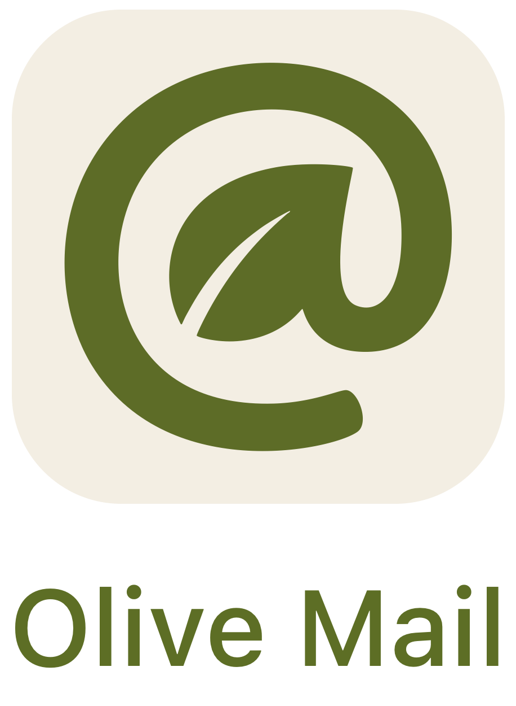

<div align="center">
  <picture>
    <source media="(prefers-color-scheme: dark)" srcset="logo/logo_icon_titled.png">
    
  </picture>
<p><b>Real Email Context for Agents</b><br>You control authentication, permissions & redactions.</p>
</div>

---

Existing mail accounts hold crucial and sensitive context for real work. But typical agents either see none of it or can do all with it – locked into their own little mailbox or holding the keys to your kingdom.

**Olive Mail** is the grown-up solution: a local mediator that you authenticate. Agents never touch your email password. They search, read, draft or send only as far as you permitted.

Agents don't _have_ to act as spokesperson for you or your company. You can employ them like interns. They can be in the loop on all things for all their work, while you're still the one who speaks.

## Status

This is early. It's a working proof of concept that we already use at Nohype AI for remote bots and coding agents. But it is not the full vision yet by far.

Theoretically, a malicious agent with a shell as the same Unix user can still read the password file. Hiding that secret needs a privilege split. Constraining what a normal agent is allowed to *ask for* does not, but it is already a better interface than direct IMAP access.

`olive-mail` is a Swift CLI with its own read API. [Himalaya](https://github.com/pimalaya/himalaya) is the v1 IMAP backend, not the interface. Agents never type `himalaya`.

**Now.** Own commands (`account add`, `mailbox list`, `email list`, `email show`). Himalaya over IMAP. `account add` writes `~/.config/olive-mail/config.toml` plus `<email>.pass`. No SMTP. Send is absent (not a Himalaya passthrough). Himalaya must be on `PATH` (`brew install himalaya`).

**Next.** Granular per-agent permission control: which folders, which senders, which dates; read vs draft; headers first, bodies only when asked. A daemon-user privilege split needs this binary.

Checklist: [TODO.md](documentation/TODO.md).

## Install

Linux and macOS. Install [Himalaya](https://github.com/pimalaya/himalaya) (`brew install himalaya`) and a Swift 6.4 toolchain, then from this checkout:

```sh
swift build -c release
```

The binary is `.build/release/olive-mail`. Put it on `PATH` if you want. From a checkout you can also `swift run olive-mail …`.

If `himalaya` is missing, mail commands fail with install text.

Add an account:

```sh
swift run olive-mail account add you@example.com --imap imaps://imap.example.com:993
```

TTY: prompts for missing email / IMAP / password. Non-TTY: email + `--imap`, password on stdin:

```sh
swift run olive-mail account add you@example.com --imap imaps://imap.example.com:993 <<EOF
your-app-password
EOF
```

Writes `~/.config/olive-mail/config.toml` and `~/.config/olive-mail/<email>.pass` (mode `0600`). Overwrites existing auth.

## Usage

```sh
olive-mail mailbox list

olive-mail email list
olive-mail email list -m MyInbox
olive-mail email list --limit 5

olive-mail email show -m MyInbox 42
olive-mail email show -m MyInbox 42 from
```

`--json` on the leaf (agents should pass it). `--help` is ours.

`email list` is newest first, default 20. Ids are per-mailbox (IMAP UID); `email show` requires `-m`. If a host’s inbox is not `INBOX`, set `mailbox.alias.inbox` in `~/.config/olive-mail/config.toml` to an id from `olive-mail mailbox list`.

There is no send command (`message send`, `smtp`, `--send` are unknown).

## Layout

```
~/.config/olive-mail/config.toml     # Himalaya config, no SMTP, generated by account add
~/.config/olive-mail/<email>.pass    # app password, mode 0600
```

`config.toml.example` in this repo is the generic template. `account add` currently writes a **single** account (it overwrites `config.toml`).

## License

[Apache License 2.0](LICENSE). Copyright 2026 Nohype AI GmbH.
