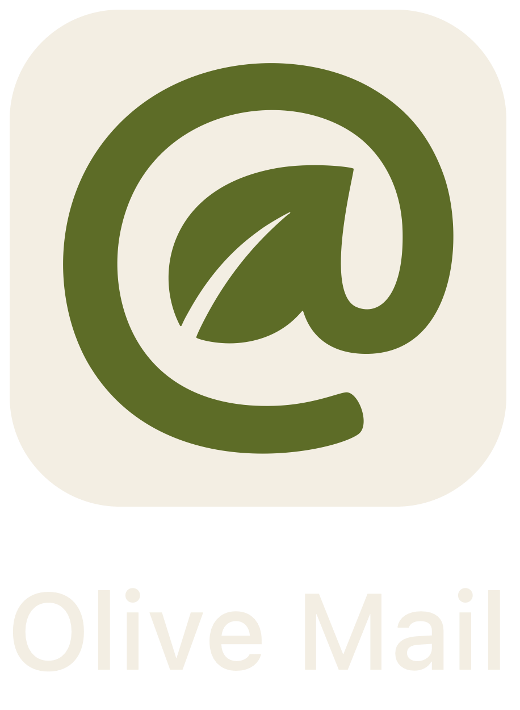

<div align="center">  

<h3>Email as Context for Agents – Controlled, Private, Token-Efficient</h3>
<p>Existing mail accounts hold crucial context for real work. Agents doing real work need that context. They don't need your credentials, unnecessary send rights or sensitive email content.</p>
</div>

---

## Install

```sh
brew install nohype-ai/tap/olive-mail
```

## Example

Human authenticates:

```sh
$ olive-mail account add you@example.com --imap imaps://imap.example.com:993
Added account you@example.com. Agents will not touch that password.
```

Agent reads but can't send:

```sh
$ olive-mail mailbox list
Inbox
Sent
Drafts

$ olive-mail email list -m Inbox
Inbox	42	Alice Chen  <alice@work.com>    you@example.com  2026-06-01T12:00:00Z  Re: Q3 close
Inbox	41	Bob Lee     <bob@work.com>      you@example.com  2026-05-28T09:14:00Z  Invoice 1842
Inbox	40	Carol       <carol@client.com>  you@example.com  2026-05-27T16:02:00Z  Next week kickoff

$ olive-mail email show -m Inbox 42
From: Alice Chen <alice@work.com>
To: you@example.com
Subject: Re: Q3 close
Date: 2026-06-01T12:00:00Z
The Q3 numbers are in. Can you review before Friday?
```

## Why

1. Typical agents either see no real email context or can do all with it – locked into their own little mailbox or holding the keys to your kingdom.
2. Real emails often contain sensitive data that a business needs to filter or redact before letting agents read emails at all.
3. Agents accessing mail accounts directly is slow, loads redundant data, offers no meaningful search, and costs a lot of tokens.

## Vision

> This is what we're building.
> 
> The proof of concept you can run today is [Current State](#current-state).

**Olive Mail** is the grown-up solution: a local mediator that you authenticate. Agents never touch your email password. They search, read, draft or send only as far as you permitted.

So agents don't _have_ to act as spokesperson for you or your company. You can employ them like interns. They can be in the loop on all things for all their work, while you're still the one who speaks.

On top of isolating credentials from agents (actual unix account separation), granular permission control, and redaction plugins for sensitive data, Olive Mail leverages a local cache across agents for super fast responses, semantic search and minimal token cost.

## Current State

Olive Mail is now a **working proof of concept that we already use** at Nohype AI for remote bots and coding agents. But it is not the full vision yet by far.

**What Works Now:**

- Human user can authenticate one email account using `account add`
- Agents can list and read emails, using `mailbox list`, `email list`, and `email show`
- Agents practically do not touch credentials and do not talk directly to mail accounts.
  - Malicious agents could theoretically still read the credentials.
- Agents practically do not send emails.
  - Malicious agents could theoretically still add an SMTP server, read the credentials and then use both to bypass Olive Mail and send.

**What's Next:**

The rough roadmap is laid out in: [TODO.md](documentation/TODO.md).

## Contribute

Contributors are welcome! Send us your feedback. Open an issue. Make a PR.

Hints on how to work on Olive Mail are in [documentation/develop.md](documentation/develop.md).

## Use

Humans authenticate their email accounts:

```sh
olive-mail account add you@example.com --imap imaps://imap.example.com:993
```

Agents and scripts read emails:

```sh
olive-mail mailbox list

olive-mail email list
olive-mail email list -m Inbox
olive-mail email list -m Inbox --limit 5

olive-mail email show -m Inbox 42
olive-mail email show -m Inbox 42 --fields from
olive-mail email show -m Inbox 42 --fields from,subject,body
```

`email list` is newest first, default `--limit 20`. Ids are per-mailbox (IMAP UID), so `email show` always needs `-m`. Omit `-m` on `email list` to span all mailboxes. `--fields` is a comma-separated subset of `from`, `to`, `subject`, `date`, `body`.

Agents should pass `--json`. `--help` works on every command. There is no send command yet.

## How it Works

`olive-mail` is a Swift CLI with its own read API. [Himalaya](https://github.com/pimalaya/himalaya) is the v1 IMAP backend, not the interface. Agents never type `himalaya`.

`account add` writes `~/.config/olive-mail/config.toml` plus `<email>.pass`. No SMTP. Send is absent (not a Himalaya passthrough). Himalaya must be on `PATH` (`brew install himalaya`)

**Config Layout:**

```
~/.config/olive-mail/config.toml     # Himalaya config, no SMTP, generated by account add
~/.config/olive-mail/<email>.pass    # app password, mode 0600
```

`account add` currently writes a **single** account (it overwrites `config.toml`).

## License

[Apache License 2.0](LICENSE). Copyright 2026 Nohype AI GmbH.
